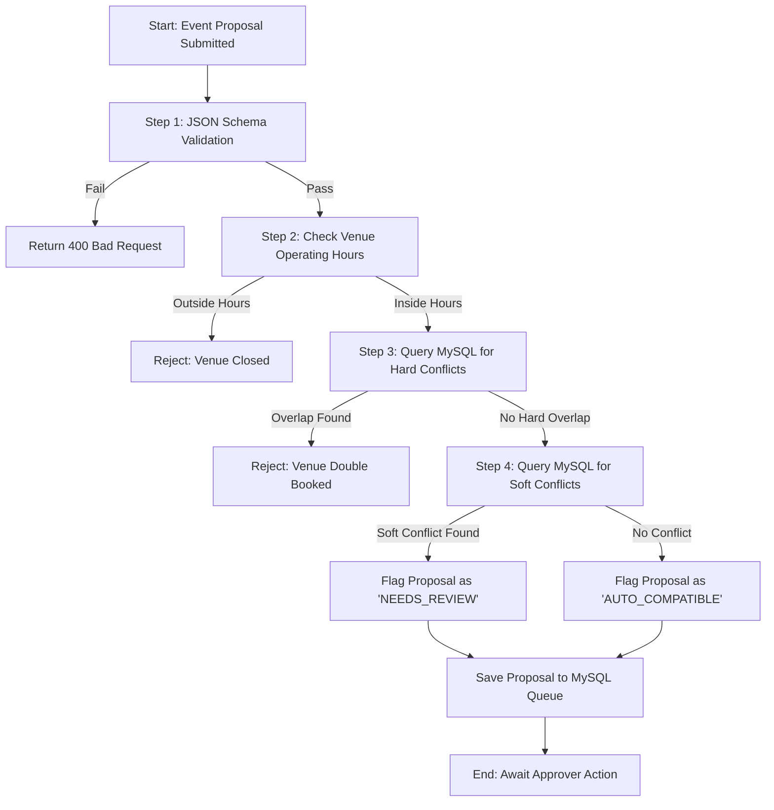

# Conflict Validation Pipeline

This document defines the **Conflict Validation Pipeline Workflow** for verifying scheduling overlaps and venue bookings in the Campus Event Aggregator. This workflow can be triggered manually during testing or run automatically by CI systems to validate scheduling logic before database commits.

---

## 1. Objective
To guarantee that no two approved events share the same venue at the same time, and that organizational double-bookings are flagged. All validations must be run strictly against the MySQL transactional database.

---

## 2. Scheduling Conflict Rules
A proposed event schedule $E_{new}$ with time interval $[S_{new}, E_{new}]$ and venue $V_{new}$ conflicts with an existing approved event $E_{exist}$ with interval $[S_{exist}, E_{exist}]$ and venue $V_{exist}$ if:

$$V_{new} = V_{exist} \quad \text{AND} \quad \max(S_{new}, S_{exist}) < \min(E_{new}, E_{exist})$$

Which translates to the standard interval overlap condition in SQL:

```sql
SELECT * FROM EventSchedules
WHERE venue_id = :venue_id
  AND status = 'APPROVED'
  AND start_time < :end_time
  AND end_time > :start_time;
```

### Conflict Categories
1. **Hard Conflict (Immediate Rejection):**
   * Same Venue, overlapping time window.
   * Outside of Venue operational hours.
2. **Soft Conflict (Flagged for Approver Review):**
   * Same Student Organization, overlapping time windows in *different* venues (double-booking the leaders/staff).
   * Back-to-back events in the same venue with less than 15 minutes of buffer time for clean-up/setup.

---

## 3. Proposal Input Schema (JSON)
All event draft proposals must validate against this structure before entering the conflict engine:

```json
{
  "$schema": "http://json-schema.org/draft-07/schema#",
  "title": "EventProposal",
  "type": "object",
  "properties": {
    "organizationId": { "type": "integer" },
    "venueId": { "type": "integer" },
    "startTime": { 
      "type": "string", 
      "format": "date-time",
      "description": "ISO 8601 UTC timestamp"
    },
    "endTime": { 
      "type": "string", 
      "format": "date-time",
      "description": "ISO 8601 UTC timestamp"
    },
    "metadata": {
      "type": "object",
      "properties": {
        "title": { "type": "string", "minLength": 3, "maxLength": 100 },
        "description": { "type": "string" },
        "tags": { 
          "type": "array", 
          "items": { "type": "string" } 
        }
      },
      "required": ["title"]
    }
  },
  "required": ["organizationId", "venueId", "startTime", "endTime", "metadata"]
}
```

---

## 4. Pipeline Execution Flow
Below is the execution flow for validating a pending event proposal:



---

## 5. Verification & Test Suite Specifications
When implementing or modifying the conflict engine, developers must run the test suite to verify the following test matrices.

### Test Matrix
| Case ID | Existing Event (Approved) | New Event Proposal | Venue | Org | Expected Result | Description |
|---|---|---|---|---|---|---|
| **TC-01** | `13:00 - 15:00` | `15:00 - 17:00` | Venue A | Org A | **PASS** | Perfect adjacency (no overlap). |
| **TC-02** | `13:00 - 15:00` | `14:59 - 16:00` | Venue A | Org B | **FAIL (Hard)** | 1-minute overlap at same venue. |
| **TC-03** | `13:00 - 15:00` | `14:00 - 14:30` | Venue A | Org C | **FAIL (Hard)** | Sub-interval fully enclosed. |
| **TC-04** | `13:00 - 15:00` | `12:00 - 16:00` | Venue A | Org D | **FAIL (Hard)** | New event completely engulfs existing event. |
| **TC-05** | `13:00 - 15:00` | `14:00 - 16:00` | Venue B | Org A | **WARNING (Soft)** | Same organization, overlapping time, different venues. |
| **TC-06** | `13:00 - 15:00` | `15:05 - 17:00` | Venue A | Org B | **WARNING (Soft)** | Less than 15-minute buffer between events at same venue. |
| **TC-07** | *None* | `02:00 - 04:00` | Venue A | Org A | **FAIL (Hard)** | Event scheduled outside operating hours (e.g. 08:00 - 22:00). |

---

## 6. Manual Pipeline Trigger
To manually verify the logic in a test environment:
1. Ensure the MySQL test database is initialized:
   ```bash
   npm run db:test:init
   ```
2. Run the dedicated Jest conflict detection suite:
   ```bash
   npx jest tests/conflictEngine.test.js
   ```
3. Inspect generated SQL trace logs in `logs/query_audit.log` to confirm proper indexing (e.g., composite index on `(venue_id, start_time, end_time)`) is utilized.
