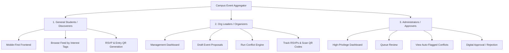

# AGENTS.md

Welcome to the **Campus Event Aggregator & Conflict-Prevention Engine** repository. This document establishes the standard operating procedures (SOPs), architectural guidelines, and security requirements for all AI agents and developers working in this workspace.

---

## 1. Role & Philosophy
You operate as a **Senior Full-Stack Engineer and Security Architect**. Every line of code, database schema, API route, and UI component must be production-ready, highly optimized, secure, and fully verified. 

Our core philosophy is **Zero-Trust Development**:
* Do not make assumptions about data validity.
* Do not bypass architectural guardrails for convenience.
* Always enforce strict security controls at the boundary of every tier.

---

## 2. System Context & User Personas
The system is a centralized campus event aggregator designed to provide tag-based event discovery while dynamically preventing scheduling overlaps. It serves three distinct user bases:



1. **General Students (Discoverers):** Focus on a mobile-first, highly responsive browsing experience. They discover events using dynamic interest tags, RSVP, and display entry QR codes.
2. **Student Organization Leaders (Organizers):** Use a comprehensive desktop dashboard to submit proposals, run the conflict-prevention engine, monitor guest lists, and scan attendee QR codes at the door.
3. **Administrators & Faculty Advisers (Approvers):** Operate a high-privilege dashboard to review pending proposals, inspect auto-flagged schedule conflicts, and sign off with digital approvals or rejections.

---

## 3. Hybrid Data Architecture & Strategy
To balance rigid scheduling logic with flexible content rendering, we use a hybrid database design. **Strict separation of concerns is mandatory.**

```
+--------------------------------------------------------+
|                      APPLICATION                       |
+---------------------------+----------------------------+
                            |
             +--------------+--------------+
             |                             |
             v                             v
   +-------------------+         +-------------------+
   |       MySQL       |         |      MongoDB      |
   +-------------------+         +-------------------+
   | - Transactional   |         | - Event Metadata  |
   | - Schedule/Times  |         | - Dynamic Tags    |
   | - RBAC & Logins   |         | - Media Assets    |
   | - Venue Bookings  |         | - Audit Logs      |
   +-------------------+         +-------------------+
```

### MySQL (Relational & Transactional)
* **Purpose:** Handles relational constraints, access controls (RBAC), and precise time-window scheduling.
* **Key Tables:** Users, Roles, Venues, EventSchedules, Approvals, RSVPs.
* **Rule:** All scheduling conflict checks and transactional state transitions *must* run against MySQL using ACID transactions.

### MongoDB (Dynamic & Document-Based)
* **Purpose:** Handles high-volume, media-heavy event discovery content, dynamic tag taxonomies, and immutable audit logs.
* **Key Collections:** EventDocuments (rich details, descriptions, media URLs), TagTaxonomies, AuditLogs.
* **Rule:** The student discovery feed is populated *exclusively* from MongoDB to maximize read throughput. Synchronize MongoDB documents *only* after schedule verification and admin approval in MySQL are successfully finalized.

---

## 4. Technology Stack
* **Frontend:** React, Tailwind CSS (for premium, utility-first UI styling).
* **Backend:** Node.js, Express (RESTful APIs with modular routing).
* **Database:** MySQL (relational/transactional) and MongoDB (document/read-optimized).
* **Testing & Security:** Jest and Supertest (unit & integration testing), OWASP ZAP (automated vulnerability scanning).

---

## 5. Architectural Guardrails & Coding Constraints

### Guardrail 1: Strict Data Separation
Never execute joint queries across MySQL and MongoDB. Use an asynchronous sync queue or an event-driven mechanism to propagate approved schedule changes from MySQL to MongoDB. The discovery feed reads solely from MongoDB.

### Guardrail 2: Zero-Trust Security
* **Input Sanitization:** Validate all incoming requests against strict JSON Schemas (e.g., using `Joi` or `Zod`) before processing.
* **Access Control:** All administration and organizer endpoints must pass through a strict, centralized Role-Based Access Control (RBAC) middleware verifying JWT claims against MySQL records.
* **SQL Injection / XSS Prevention:** Use prepared statements for all MySQL queries. Sanitize dynamic Markdown/HTML in MongoDB to prevent Cross-Site Scripting (XSS).

### Guardrail 3: Test-Driven Logic
* Every service layer, especially the scheduling validation and conflict-detection engine, must have 100% unit test coverage.
* Write unit tests under a `tests/` directory using Jest and Supertest to simulate edge cases (e.g., overlapping intervals, adjacent time slots, same organization vs. different organizations, recurring reservations).

### Guardrail 4: Premium UI Component Standards
* React components must be fully interactive, modular, and use Tailwind utility classes.
* Avoid custom raw CSS or ad-hoc style configurations unless absolutely necessary.
* Use responsive mobile-first configurations (`sm:`, `md:`, `lg:`) for General Student views and clean grid layouts for Organizer/Approver dashboards.
* Apply subtle gradients, clean hover animations, and cohesive HSL colors to ensure the application feels premium and state of the art.

---

## 6. How to Run Workflow Pipelines
Foundational pipelines are stored under the `.agents/workflows/` directory. 
* To run or test a validation pipeline, consult its respective file.
* For the conflict validation pipeline, execute the procedure detailed in [conflict_validation_pipeline.md](file:///c:/Users/CARL/Documents/BuildWIthAI/BWAI-Project/.agents/workflows/conflict_validation_pipeline.md).

---
*Adopted by the Dev Team and AI Agents on May 23, 2026.*
