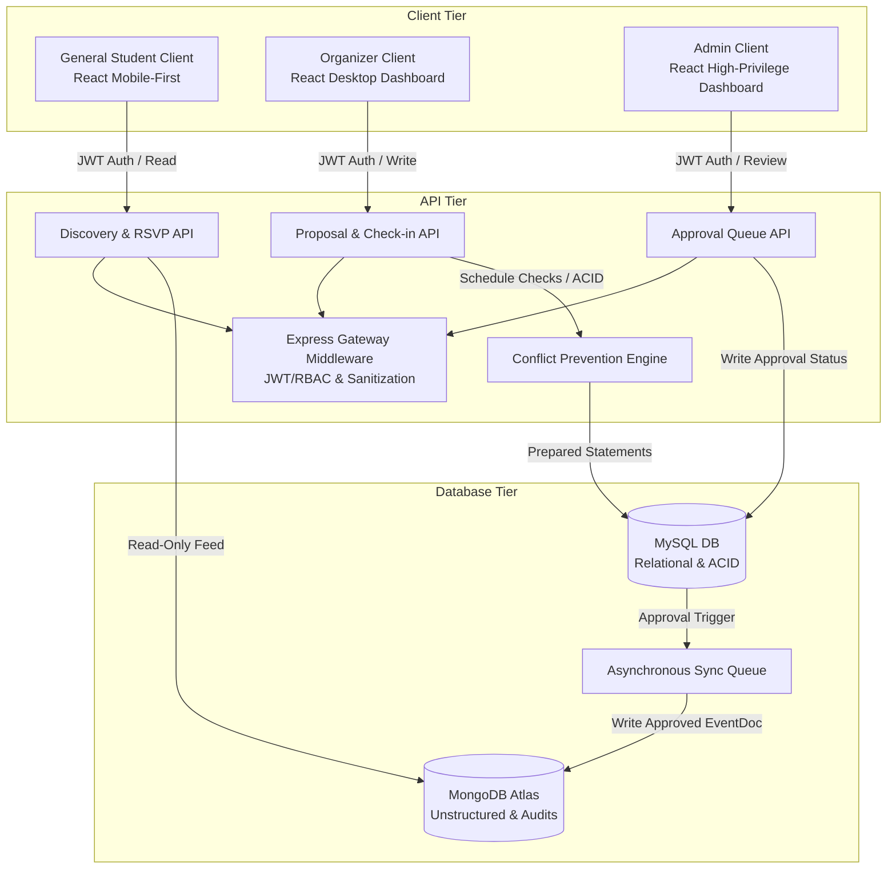

# System Design Document (SDD)

## 1. Document Overview & Context
This System Design Document (SDD) describes the system architecture, database design, conflict-prevention algorithms, and data synchronization flows for the **Campus Event Aggregator & Conflict-Prevention Engine**.

This document is cross-referenced with the [Product Requirements Document (PRD)](file:///c:/Users/CARL/Documents/BuildWIthAI/BWAI-Project/docs/prd.md) and the [UI/UX Design Document](file:///c:/Users/CARL/Documents/BuildWIthAI/BWAI-Project/docs/design.md).

---

## 2. High-Level System Architecture

The system utilizes a 3-tier architecture with a specialized hybrid database tier. The strict separation of concerns separates transaction-heavy operational data (MySQL) from read-heavy content discovery feeds (MongoDB).



---

## 3. Hybrid Database Strategy & Mappings

### 3.1. MySQL Schema Design (Relational & Transactional)
MySQL enforces access roles, exact schedule intervals, and room capacities.

```sql
-- Role-Based Access Control (RBAC) & Accounts
CREATE TABLE users (
    id INT AUTO_INCREMENT PRIMARY KEY,
    email VARCHAR(255) UNIQUE NOT NULL,
    password_hash VARCHAR(255) NOT NULL,
    role ENUM('STUDENT', 'ORGANIZER', 'ADMIN') NOT NULL,
    created_at TIMESTAMP DEFAULT CURRENT_TIMESTAMP
);

CREATE TABLE venues (
    id INT AUTO_INCREMENT PRIMARY KEY,
    name VARCHAR(100) UNIQUE NOT NULL,
    capacity INT NOT NULL,
    operating_start TIME NOT NULL, -- e.g., '08:00:00'
    operating_end TIME NOT NULL -- e.g., '22:00:00'
);

CREATE TABLE event_schedules (
    id INT AUTO_INCREMENT PRIMARY KEY,
    organization_id INT NOT NULL,
    venue_id INT NOT NULL,
    start_time DATETIME NOT NULL,
    end_time DATETIME NOT NULL,
    status ENUM('PENDING', 'APPROVED', 'REJECTED', 'NEEDS_REVIEW') DEFAULT 'PENDING',
    created_at TIMESTAMP DEFAULT CURRENT_TIMESTAMP,
    FOREIGN KEY (venue_id) REFERENCES venues(id),
    FOREIGN KEY (organization_id) REFERENCES users(id),
    INDEX idx_schedule (venue_id, start_time, end_time, status)
);

CREATE TABLE approvals (
    id INT AUTO_INCREMENT PRIMARY KEY,
    event_schedule_id INT NOT NULL,
    admin_id INT NOT NULL,
    action ENUM('APPROVED', 'REJECTED') NOT NULL,
    reason TEXT NULL,
    action_date TIMESTAMP DEFAULT CURRENT_TIMESTAMP,
    FOREIGN KEY (event_schedule_id) REFERENCES event_schedules(id),
    FOREIGN KEY (admin_id) REFERENCES users(id)
);

CREATE TABLE rsvps (
    id INT AUTO_INCREMENT PRIMARY KEY,
    event_schedule_id INT NOT NULL,
    user_id INT NOT NULL,
    checked_in BOOLEAN DEFAULT FALSE,
    qr_signature VARCHAR(255) UNIQUE NOT NULL,
    created_at TIMESTAMP DEFAULT CURRENT_TIMESTAMP,
    FOREIGN KEY (event_schedule_id) REFERENCES event_schedules(id),
    FOREIGN KEY (user_id) REFERENCES users(id)
);
```

### 3.2. MongoDB Schema Design (Document & Read-Optimized)
MongoDB stores the media assets, dynamic tags, and audit logs. The student feed is populated **exclusively** from the `EventDocuments` collection.

#### Collection: `EventDocuments`
```json
{
  "_id": "ObjectId",
  "mysql_event_id": 42,
  "title": "Hackathon 2026",
  "description": "24-hour campus coding tournament.",
  "media_urls": [
    "https://cdn.campus.edu/events/hackathon_banner.png"
  ],
  "tags": ["tech", "hackathon", "coding", "networking"],
  "organizer_name": "Developer Student Club",
  "venue": {
    "venue_id": 3,
    "name": "Grand Ballroom",
    "capacity": 250
  },
  "schedule": {
    "start_time": "2026-10-15T08:00:00Z",
    "end_time": "2026-10-16T08:00:00Z"
  },
  "status": "APPROVED",
  "rsvps_count": 142
}
```

#### Collection: `AuditLogs`
Stores history of high-privilege events for security compliance.
```json
{
  "_id": "ObjectId",
  "timestamp": "2026-05-23T13:30:00Z",
  "actor": {
    "user_id": 12,
    "email": "evelyn.marcus@campus.edu",
    "role": "ADMIN"
  },
  "action": "EVENT_APPROVED",
  "target_entity": "event_schedules",
  "target_id": 42,
  "changes": {
    "before": "PENDING",
    "after": "APPROVED"
  }
}
```

---

## 4. Conflict-Prevention Engine Logic

The engine executes conflict validation in two sequential stages:

### Stage 1: Hard Conflict Validation (Physical Overlap)
An event proposal is **immediately rejected** if it breaches physical space availability.

```
Proposal: Venue V, [S_new, E_new]
   |
   +---> MySQL Check 1: Venue operational boundaries
   |     Is S_new >= V.operating_start AND E_new <= V.operating_end?
   |     NO  --> REJECT ("Venue Closed")
   |     YES --> Continue
   |
   +---> MySQL Check 2: Physical Venue Schedule Overlap
         Does an APPROVED booking exist in V during [S_new, E_new]?
         SQL: start_time < E_new AND end_time > S_new
         YES --> REJECT ("Venue Double Booked")
         NO  --> Continue to Stage 2
```

### Stage 2: Soft Conflict Validation (Audience & Organizer Overlap)
A proposal is **flagged with warnings** (status: `NEEDS_REVIEW`) if it passes Stage 1 but overlaps organizational or audience interests.

```
MySQL Check 3: Organizer Double-Booking
Does the proposing organization have another APPROVED or PENDING event during [S_new, E_new]?
YES --> FLAG WARNING ("Organizer double-booked across venues")

MongoDB Check 4: Tag-Based Audience Overlap
Does another APPROVED event share tags with the new proposal during [S_new, E_new]?
YES --> FLAG WARNING ("Audience overlap: [List of overlapping tags]")
```

---

## 5. Synchronous State & Event Sync Pipeline

To preserve **Strict Data Separation** (Guardrail 1) without complex distributed transactions:

1. **State Modifications:** All event submissions, approvals, or rejections write *strictly* to the MySQL relational tables inside an ACID transaction.
2. **Approval Handler:** Upon successful commit of an `APPROVED` state in the MySQL `event_schedules` table, the application triggers a synchronization hook.
3. **Queue Push:** A background worker or transactional event emitter pushes a synchronization payload to the `EventDocuments` collection in MongoDB.
4. **Read Layer:** The student feed API reads from MongoDB with high throughput. If a sync fails, a reconciliation cron-job runs every 10 minutes to verify and correct any missing records between MySQL and MongoDB.
